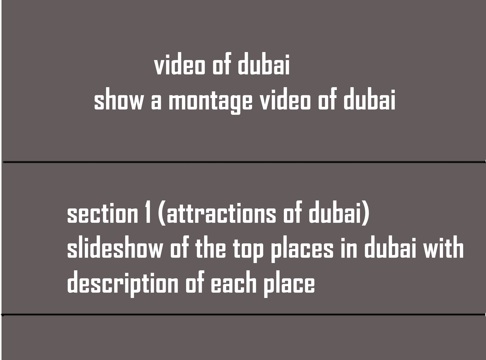
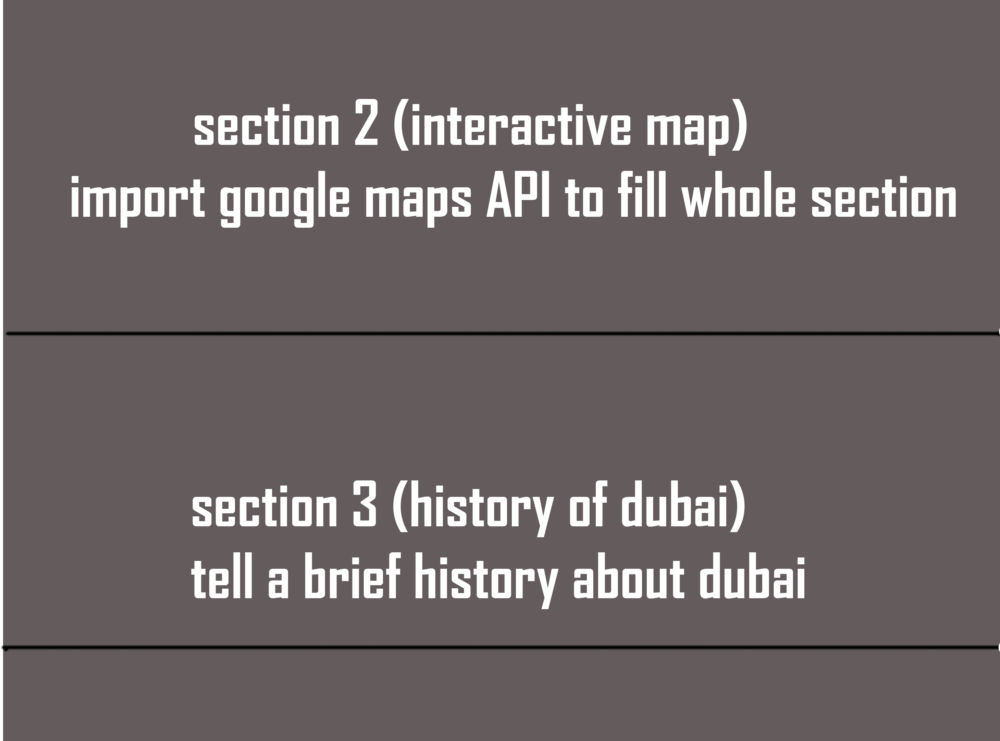
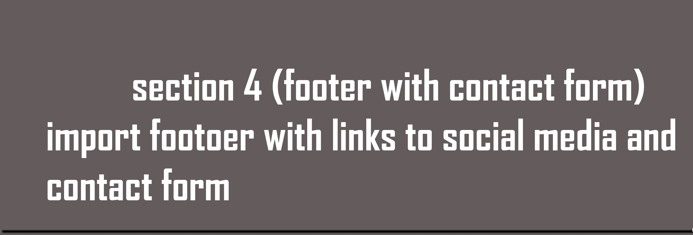
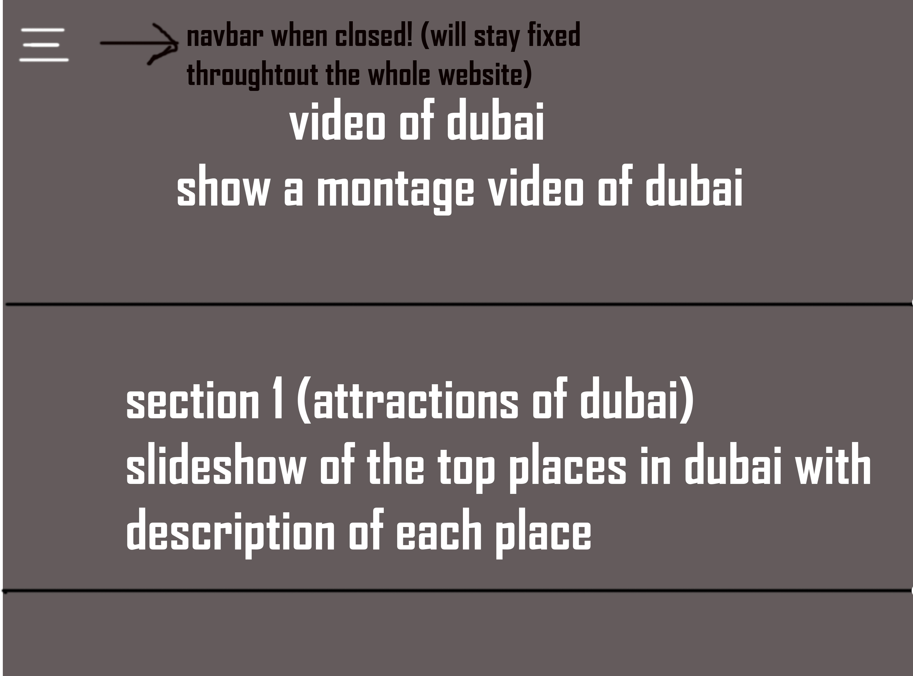
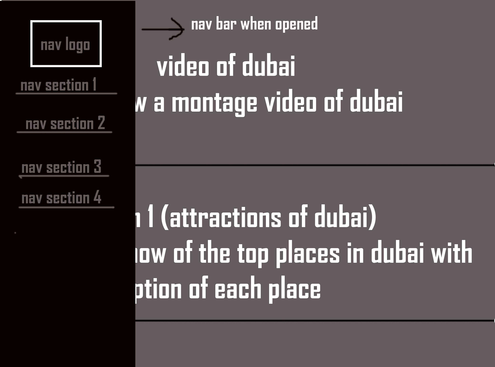

# Front End Web Development | CTEC3905
## P15206364

## GitHub Pages Link :
https://alphyk25.github.io/frontendwebsite/
## GitHub Repository Link :
https://github.com/alphyk25/frontendwebsite

# Introduction
This is a tourism targeted website based on Dubai. The aim of the website is to guide dubai toursits on what to look around for when they visit. 

Visiting the website, the users will get an opportunity to guide themselves with the top attractions of the city and an interactive map to guide them when they reach there. 

The core technology/languages used for the creation of this website are JS/CSS/HTML. The website does not include backend,
however the contact form used is applied as an outline for an idea of how it would look with backend. 

The site is simple and responsive. The website can be accesed from diffrent devices. Also, the wesite consists of a straight forward layout and is easy to navigate. 

# Design
My concept of the website was it to be a parralax design.The tutor suggested on making a project which followed a modern concept. The site was then designed as a single page with a parralax flow. After pitching the idea to the tutor, the idea got approved and ready to be designed.

Even though the parralax idea got approved, I didn't have any past experience with parralax webite nor did I know how to lay it out. However,  I took this task as a challenge and looked at a variety of parralax videos on youtube to gain more knowledge. One thing I found as a fundamental value to a good parralax design is the interaction with the user. Most websites I looked at interacted with the user one way or another.

The first stage was to develop a sketch of the website. The plans of the website are very basic as I know that I will never follow the same design when it comes to creating the website. I have managed to follow all the information that will be included in the page (shown in sketch). The design is also similar.

## rough plan of the layout and information
 
 
 
## how the navbar operates in this website
 
 

# Video
The user is greeted with a video of Dubai when visiting the website. The video shows all the attractions od Dubai. I did this to give a good impression for the user, so they will carry on navigating the website. Just as the video loads the hamburger style nav bar will appear on the left hand side of the page.

# Nav Bar
My first idea was to have a fixed horizontal nav bar at the top, however, after reseraching other parralax websites, I changed my style to a hamburger style menu as that was more modern. My next plan was to make the nav bar stay in a fixed position as that will be be more user friendly. The nav bar will have 4 sections and will be linked to the relevant section on the page.

# Section 1 Top attractions
My first idea was to have a slideshow just showing pictures of the top places in Dubai. However, after asking opinion to other students and tutors I was told to do something that interacts with the user more. Working on the feedback I recieved and with help from W3Schools, I developed a slideshow where users can select the thumbnail image (location images) they want to view and know more information about thier chosen location. 

# Section 2 Interactive Map
For the second section in the website, my plan was to have Google maps implemented. From the previous experience during labs I not only leared how to add google maps to a website, but also how to set markers on your desired locations and give them labels. With the help of a latlong finder, I set markers to my desired attractions in Dubai as this will help a user on the directions they have to follow to reach that destination.

# Section 3 History
Section 3 consists of the histoy of Dubai. This gives the user to know more about the past about the iconic city they were scrolling through before. Again I planned to do this to interact with the audience more.  

# Section 4 Footer 
After researching a lot of footers on diffrent websites. I came to a decision to have a footer that has a contact form and social media links for the user to contact the company.

Using Fontawsome icons I created a facebook and twitter icon linking them to relevent pages. I also created a contact form on the footer as the main aim of the website is to interact with audience as much as possible.

# Section 5 Contact Form
The contact form was created with the help of W3Schools. A simple form allowing the user to contact the company using thier email. This function would work with a backend.

# Testing
To test the website a manual inspection was done by myself. To look from a normal user's point of view, the website was also tested by a family member. In the testing the following points were looked at:
Responsiveness,how well the functions and technologies work & how the website interacted with the audience.

The website was tested on diffrent devices to ensure responsibility was working properly. Every element was tested and all it did work properly on all devices. Everything was resizing according to how it was set for different devices.

The person who tested the website mentioned the website is good and interacts with the audience a lot. Also, mentioned that the design and layout is visually pleasing. On testing the responsivness of the website, the person said all items fit according to the device and all the links work perfecty. However, on the improvement side of things, the person mentioned to include more on the navbar and footer.

# Reference
Background/Images:

All images used within the website are downloaded from Adobe Stock and Pexels.

Features on page:

https://www.w3schools.com/w3css/w3css_slideshow.asp
https://www.w3schools.com/css/css_navbar.asp
https://www.w3schools.com/howto/howto_css_parallax.asp
https://www.w3schools.com/css/css_positioning.asp

Youtube links to help with parallax:

https://www.youtube.com/watch?v=eDIZoNlJ60o

https://www.youtube.com/watch?v=JttTcnidSdQ

# Compatibility
The site is compatible with Chrome/FireFox and Edge.

There are some issues regarding navigation and svg file when viewed on Edge. However, due to the lack of knowledge and shortage of time I could not find a way to fix this problem.

 
# Improvements/Criticism
Improvements
----------------------------------------------------
There is always a room for improvement. Firsty, I would improve the parralex design to make it adapt to more javascript functions. By doing this it will only make the website stand out more. 

Secondly, I would add more functions to the navbar itself such as giving it an animated functionality. 

Finally, I will make it compatible with different browsers with custom rules for the layout of the website.

Criticism
------------------------------------------------------------------------------------------------------------------------
Even though everything worked according to plan, I would still improve it if I had another chance. Some elements would have been easier if done with JQuery and Bootstrap but most of the functions worked just fine.

# Tools used
 VS Code

